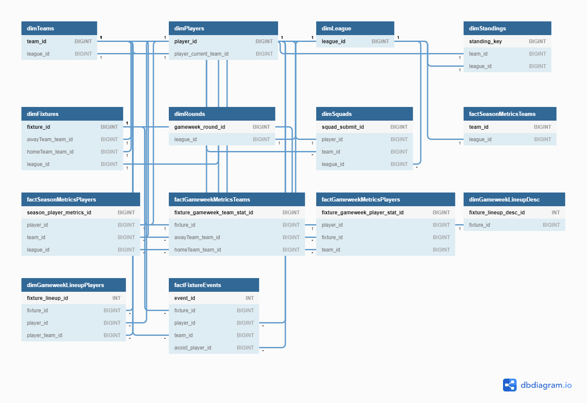
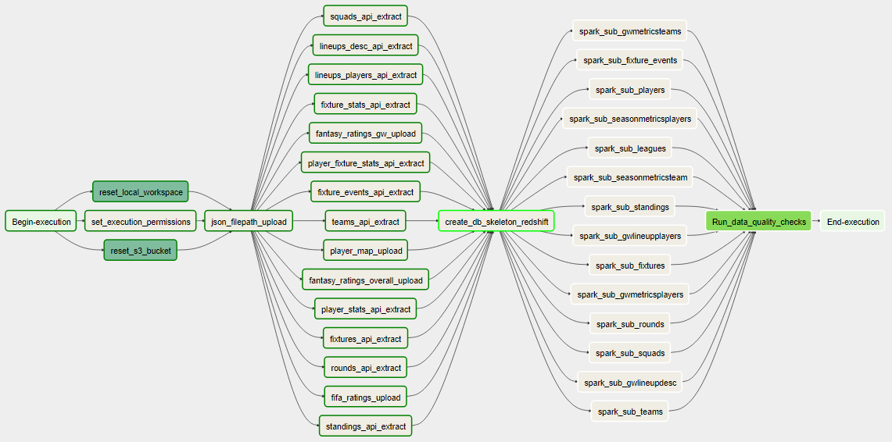

# Udacity Data Engineering Nanodegree Capstone Project

## 2018/2019 English Premier League Football Data Model

### Project Summary

The purpose of the data Engineering Capstone Project is to combine and showcase the technologies and techniques learned throughout the program. I decided to collect and combine data on the 2018/2019 English Premier League Season to create a comprehensive data model that is easy to visualise for beginners using Tableau Desktop Public.

---

### Datasets Used

I chose data from three seperate sources both due to complexity, completeness and availability of what I was trying to create:

1. [RapidAPI - API-Football](https://rapidapi.com/api-sports/api/api-football) - JSON Format

The RapidAPI Football includes data on +630 football leagues & cups. Livescore (15s), odds, events, line-ups, coaches, players, top scorers, standings, statistics, transfers and match result predictions. This API was used to extract the majority of the data used in the project. From this source I extracted player season stats, team season stats, match events, individual fixture stats, fixture lineups, league standings and team squads.

[This data is available in this repository here](https://github.com/gareth-michael-hughes/DENG-Capstone-Football-Warehouse/tree/master/Data)

2. [Fifa 2019 Player Ratings - Kaggle Dataset](https://www.kaggle.com/karangadiya/fifa19) - CSV Format

This publicly available kaggle dataset includes detailed attributes for every player registered in the latest edition of FIFA 19 database. This data is originally scraped from https://sofifa.com/ and is joined to each player to provide some additional perspective on their season performance and expectations given their in game rating.

[This data is available in this repository here](https://github.com/gareth-michael-hughes/DENG-Capstone-Football-Warehouse/tree/master/Data/fifa-ratings)

3. [Fantasy Premier League Performance](https://github.com/vaastav/Fantasy-Premier-League) - CSV Format

The final piece of the data model is a Fantasy Premier League library that gets all the basic stats for each player, gameweek-specific data for each player and season history of each player, including how many fantasy players have selected a particular player for each gameweek round. I forked this repository on github before uploading the csv files to the project workspace. For more information on fantasy football see here:  
https://fantasy.premierleague.com/

[This data is available in this repository here](https://github.com/gareth-michael-hughes/DENG-Capstone-Football-Warehouse/tree/master/Data/fantasy-ratings)

---

### Project Submission Types

This project includes two standalone submission types:

1. **An Ipython Jupyter notebook that can be used to execute each task within the project in chronological order.**  

2. **An Airflow DAG that can be scheduled to run and produce the desired data warehouse as described.**  
[All files needed to reproduce this project can be found here](https://github.com/gareth-michael-hughes/DENG-Capstone-Football-Warehouse/tree/master/airflow/).

### Files in the Repository

#### Jupyter Notebook to run the project submission

- [CapstoneProject.ipynb](https://github.com/gareth-michael-hughes/DENG-Capstone-Football-Warehouse/blob/master/CapstoneProject.ipynb): Jupyter notebook that runs through a step by step execution of each of the project steps to create the data warehouse
- [helper_functions.py](https://github.com/gareth-michael-hughes/DENG-Capstone-Football-Warehouse/blob/master/helper_functions.py): A collection of frequently used functions that are imported into the jupyter notebook for cleaner presentation of code.

#### Extracting and Uploading Data

- [player_map_upload.py](https://github.com/gareth-michael-hughes/DENG-Capstone-Football-Warehouse/tree/master/Downloading/player_map_upload.py): Uploads the player mapping table csv to join the 3 data sources to the s3 bucket
- [player_fixture_stats_api_extract.py](https://github.com/gareth-michael-hughes/DENG-Capstone-Football-Warehouse/tree/master/Downloading/player_fixture_stats_api_extract.py): Extracts stats for each player from each fixture from Rapid API and uploads the json file to the s3 bucket
- [fixture_events_api_extract.py](https://github.com/gareth-michael-hughes/DENG-Capstone-Football-Warehouse/tree/master/Downloading/fixture_events_api_extract.py): Extracts stats for each event from each fixture from Rapid API and uploads the json file to the s3 bucket
- [fixture_stats_api_extract.py](https://github.com/gareth-michael-hughes/DENG-Capstone-Football-Warehouse/tree/master/Downloading/fixture_stats_api_extract.py): Extracts stats for team player from each fixture from Rapid API and uploads the json file to the s3 bucket
- [lineups_players_api_extract.py](https://github.com/gareth-michael-hughes/DENG-Capstone-Football-Warehouse/tree/master/Downloading/lineups_players_api_extract.py): Extracts each player lineup from each fixture from Rapid API and uploads the json file to the s3 bucket
- [player_stats_api_extract.py](https://github.com/gareth-michael-hughes/DENG-Capstone-Football-Warehouse/tree/master/Downloading/player_stats_api_extract.py): Extracts season stats for each player from Rapid API and uploads the json file to the s3 bucket
- [squads_api_extract.py](https://github.com/gareth-michael-hughes/DENG-Capstone-Football-Warehouse/tree/master/Downloading/squads_api_extract.py): Extracts each squad submitted by each team for the season from Rapid API and uploads the json file to the s3 bucket
- [lineups_desc_api_extract.py](https://github.com/gareth-michael-hughes/DENG-Capstone-Football-Warehouse/tree/master/Downloading/lineups_desc_api_extract.py): Extracts descriptive information about each lineup from each fixture from Rapid API and uploads the json file to the s3 bucket
- [fixtures_api_extract.py](https://github.com/gareth-michael-hughes/DENG-Capstone-Football-Warehouse/tree/master/Downloading/fixtures_api_extract.py): Extracts the season list of fixtures from Rapid API and uploads the json file to the s3 bucket
- [rounds_api_extract.py](https://github.com/gareth-michael-hughes/DENG-Capstone-Football-Warehouse/tree/master/Downloading/rounds_api_extract.py): Extracts the season list of gameweek rounds from Rapid API and uploads the json file to the s3 bucket
- [standings_api_extract.py](https://github.com/gareth-michael-hughes/DENG-Capstone-Football-Warehouse/tree/master/Downloading/standings_api_extract.py): Extracts the season table standings from the final gameweek from Rapid API and uploads the json file to the s3 bucket
- [teams_api_extract.py](https://github.com/gareth-michael-hughes/DENG-Capstone-Football-Warehouse/tree/master/Downloading/teams_api_extract.py): Extracts the list of teams involved in the season from Rapid API and uploads the json file to the s3 bucket
- [fantasy_ratings_overall_upload.py](https://github.com/gareth-michael-hughes/DENG-Capstone-Football-Warehouse/tree/master/Downloading/fantasy_ratings_overall_upload.py): Uploads the overall player fantasy ratings csv to the s3 bucket
- [fifa_ratings_upload.py](https://github.com/gareth-michael-hughes/DENG-Capstone-Football-Warehouse/tree/master/Downloading/fifa_ratings_upload.py): Uploads the player fifa 19 ratings csv to the s3 bucket
- [fantasy_ratings_gw_upload.py](https://github.com/gareth-michael-hughes/DENG-Capstone-Football-Warehouse/tree/master/Downloading/fantasy_ratings_gw_upload.py): Uploads the player fantasy ratings for each gameweek to the s3 bucket
- [json_filepath_upload.py](https://github.com/gareth-michael-hughes/DENG-Capstone-Football-Warehouse/tree/master/Downloading/json_filepath_upload.py): Uploads the json file paths needed to instruct the json COPY from s3 to Redshift, to the s3 bucket
- [api_upload_helpers.py](https://github.com/gareth-michael-hughes/DENG-Capstone-Football-Warehouse/tree/master/Downloading/api_upload_helpers.py): A set of reuseable functions to extract, format and upload data to s3

#### Creating the Data Model and Staging Data

- [sql_stage_queries.py](https://github.com/gareth-michael-hughes/DENG-Capstone-Football-Warehouse/tree/master/Staging/sql_stage_queries.py): SQL queries for dropping, creating and loading of staging table data from s3 into redshift 
- [sql_transform_load_queries.py](https://github.com/gareth-michael-hughes/DENG-Capstone-Football-Warehouse/tree/master/Staging/sql_transform_load_queries.py): SQL queries for dropping and creating the analytical table skeletons in redshift 
- [create_db_skeleton_redshift.py](https://github.com/gareth-michael-hughes/DENG-Capstone-Football-Warehouse/tree/master/Staging/create_db_skeleton_redshift.py): Runs each of the DROP, CREATE and COPY queries against the Redhshift database

#### Transforming and Loading Data into Final Analytical Tables using Spark

- [gwMetricsPlayers_spark.py](https://github.com/gareth-michael-hughes/DENG-Capstone-Football-Warehouse/tree/master/Transform_Load/gwMetricsPlayers_spark.py): Spark job that transforms player gameweek stats and loads it into the table in Redshift
- [seasonMetricsPlayers_spark.py](https://github.com/gareth-michael-hughes/DENG-Capstone-Football-Warehouse/tree/master/Transform_Load/seasonMetricsPlayers_spark.py): Spark job that transforms player season stats and loads it into the table in Redshift
- [seasonMetricsTeam_spark.py](https://github.com/gareth-michael-hughes/DENG-Capstone-Football-Warehouse/tree/master/Transform_Load/seasonMetricsTeam_spark.py): Spark job that transforms team season stats and loads it into the table in Redshift
- [rounds_spark.py](https://github.com/gareth-michael-hughes/DENG-Capstone-Football-Warehouse/tree/master/Transform_Load/rounds_spark.py): Spark job that transforms gameweek rounds data and loads it into the table in Redshift
- [teams_spark.py](https://github.com/gareth-michael-hughes/DENG-Capstone-Football-Warehouse/tree/master/Transform_Load/teams_spark.py): Spark job that transforms team description data and loads it into the table in Redshift
- [standings_spark.py](https://github.com/gareth-michael-hughes/DENG-Capstone-Football-Warehouse/tree/master/Transform_Load/standings_spark.py): Spark job that transforms league standings data and loads it into the table in Redshift
- [squads_spark.py](https://github.com/gareth-michael-hughes/DENG-Capstone-Football-Warehouse/tree/master/Transform_Load/squads_spark.py): Spark job that transforms team squads data and loads it into the table in Redshift
- [players_spark.py](https://github.com/gareth-michael-hughes/DENG-Capstone-Football-Warehouse/tree/master/Transform_Load/players_spark.py): Spark job that transforms player data and loads it into the table in Redshift
- [leagues_spark.py](https://github.com/gareth-michael-hughes/DENG-Capstone-Football-Warehouse/tree/master/Transform_Load/leagues_spark.py): Spark job that transforms league descriptive data and loads it into the table in Redshift
- [gwMetricsTeams_spark.py](https://github.com/gareth-michael-hughes/DENG-Capstone-Football-Warehouse/tree/master/Transform_Load/gwMetricsTeams_spark.py): Spark job that transforms team gameweek stats and loads it into the table in Redshift
- [gwLineupPlayers_spark.py](https://github.com/gareth-michael-hughes/DENG-Capstone-Football-Warehouse/tree/master/Transform_Load/gwLineupPlayers_spark.py): Spark job that transforms player gameweek lineup data and loads it into the table in Redshift
- [gwLineupDesc_spark.py](https://github.com/gareth-michael-hughes/DENG-Capstone-Football-Warehouse/tree/master/Transform_Load/gwLineupDesc_spark.py): Spark job that transforms descriptive gameweek lineup data and loads it into the table in Redshift
- [fixtureEvents_spark.py](https://github.com/gareth-michael-hughes/DENG-Capstone-Football-Warehouse/tree/master/Transform_Load/fixtureEvents_spark.py): Spark job that transforms gameweek fixture events data and loads it into the table in Redshift
- [fixtures_spark.py](https://github.com/gareth-michael-hughes/DENG-Capstone-Football-Warehouse/tree/master/Transform_Load/fixtures_spark.py): Spark job that transforms gameweek fixture list data and loads it into the table in Redshift

#### Configuration Files

- [ars.cfg](https://github.com/gareth-michael-hughes/DENG-Capstone-Football-Warehouse/tree/master/Configs/ars.cfg): Configuration file that includes all frequently used parameters for connections to s3, AWS and Redshift
- [RedshiftJDBC42-no-awssdk-1.2.45.1069.jar](https://github.com/gareth-michael-hughes/DENG-Capstone-Football-Warehouse/tree/master/Configs/RedshiftJDBC42-no-awssdk-1.2.45.1069.jar): driver used by Spark on execution of jobs to write data to Redshift tables 
- [rounds_path.json](https://github.com/gareth-michael-hughes/DENG-Capstone-Football-Warehouse/tree/master/Data/json-paths/rounds_path.json): json file path used by Redshift when copying json data from s3
- [team_squads_path.json](https://github.com/gareth-michael-hughes/DENG-Capstone-Football-Warehouse/tree/master/Data/json-paths/team_squads_path.json): json file path used by Redshift when copying json data from s3
- [teams_path.json](https://github.com/gareth-michael-hughes/DENG-Capstone-Football-Warehouse/tree/master/Data/json-paths/teams_path.json): json file path used by Redshift when copying json data from s3
- [fixture_player_stats_path.json](https://github.com/gareth-michael-hughes/DENG-Capstone-Football-Warehouse/tree/master/Data/json-paths/fixture_player_stats.json): json file path used by Redshift when copying json data from s3
- [fixture_stats_path.json](https://github.com/gareth-michael-hughes/DENG-Capstone-Football-Warehouse/tree/master/Data/json-paths/fixture_stats_path.json): json file path used by Redshift when copying json data from s3
- [player_stats_path.json](https://github.com/gareth-michael-hughes/DENG-Capstone-Football-Warehouse/tree/master/Data/json-paths/player_stats_path.json): json file path used by Redshift when copying json data from s3
- [events_path.json](https://github.com/gareth-michael-hughes/DENG-Capstone-Football-Warehouse/tree/master/Data/json-paths/events_path.json): json file path used by Redshift when copying json data from s3
- [fixtures_path.json](https://github.com/gareth-michael-hughes/DENG-Capstone-Football-Warehouse/tree/master/Data/json-paths/fixtures_path.json): json file path used by Redshift when copying json data from s3
- [standings_path.json](https://github.com/gareth-michael-hughes/DENG-Capstone-Football-Warehouse/tree/master/Data/json-paths/standings_path.json): json file path used by Redshift when copying json data from s3
- [lineups_descriptive_path.json](https://github.com/gareth-michael-hughes/DENG-Capstone-Football-Warehouse/tree/master/Data/json-paths/lineups_descriptive_path.json): json file path used by Redshift when copying json data from s3
- [lineup_players_path.json](https://github.com/gareth-michael-hughes/DENG-Capstone-Football-Warehouse/tree/master/Data/json-paths/lineup_players_path.json): json file path used by Redshift when copying json data from s3
- [player_map_table.csv](https://github.com/gareth-michael-hughes/DENG-Capstone-Football-Warehouse/tree/master/Data/player_map/player_map_table.csv): player mapping table raw csv used to create the player map staging table to join fantasy, fifa and game metrics by player

#### Airflow Specific Files

Each of the files mentioned in the sections above is also included in the airflow project submission.
The following files are also included that are specific to running the airflow project submission:

#### DAG

- [capstone_dag.py](https://github.com/gareth-michael-hughes/DENG-Capstone-Football-Warehouse/tree/master/airflow/dags/capstone_dag.py): Airflow dag that extracts and loads data to s3, transfers to staging tables in Redshift and then transforms and upserts data into final analytical tables in Redshift via Spark

#### Plugins and Custom Operators

- [reset_local_workspace.py](https://github.com/gareth-michael-hughes/DENG-Capstone-Football-Warehouse/tree/master/airflow/plugins/operators/reset_local_workspace.py): Deletes all files in folders that store extracted data from the API endpoints.
- [reset_s3_bucket.py](https://github.com/gareth-michael-hughes/DENG-Capstone-Football-Warehouse/tree/master/airflow/plugins/operators/reset_s3_bucket.py): Deletes all objects and keys in the s3 bucket to clear out the pre-staging area.
- [data_quality.py](https://github.com/gareth-michael-hughes/DENG-Capstone-Football-Warehouse/tree/master/airflow/plugins/operators_data_quality.py): Checks for number of records and null values in each of the Redshift analytical tables

#### Data dictionary

- [data dictionary](https://github.com/gareth-michael-hughes/DENG-Capstone-Football-Warehouse/tree/master/Configs/data_dictionary.txt): A data dictionary referencing each table, column, data type and context description.

---

### Data Model

For the data model I tried to keep the table entities in as close to 3rd Normal Form as possible. In the view of a data analyst I anticipate there to be 4 focal points of interest in the data:

- The overall performance of a team across the season
- The overall performance of a player across a season
- The performance of a team in an individual fixture
- The performance of a player in an individual fixture

To accurately capture this structure while minimising the number of potential SQL joins required by a user I organised the table entities into groups of fact and dimension tables that represent somewhat of a snowflake schema.

The most important thing to take note when joining the staging tables together is the use of the player mapping table located in [Data/player_map/player_map_table.csv](https://github.com/gareth-michael-hughes/DENG-Capstone-Football-Warehouse/tree/master/Data/player_map/player_map_table.csv) and is also loaded to redshift for use as `staging_player_map_table`. This table consists of `original_player_id` (the player id extracted from each squad of the API data source) `fantasy_id` (the player_id from each player in the fantasy league stats data extract) and a `fifa_id` (the player_id for each player in the FIFA 19 data extract). I created this table to avoid any potential errors when joining on player names along as many player names include special characters, are duplicates or are inconsistent across the three sources.

These analytical table are described below. For further information see the schema diagram below and the data dictionary in Step 4:

Analytical Tables:

- **dimTeams:** *descriptive information about each of the teams in the Premier League for the 2018/2019 season*
- **dimPlayers:** *descriptive information about each of the players involved in the Premier League for the 2018/2019 season*
- **dimLeague:** *descriptive information about the league, in case the database in expanded past the Premier League season of 2018/19*
- **dimStandings:** *The league table rankings as of the final gameweek 38 at the end of the season*
- **dimFixtures:** *The list of all 380 fixtures and descriptive information about each fixture*
- **dimRounds:** *Unique identifier for each of the 38 gameweek rounds for the season*
- **dimSquads:** *A table that represents how each player is attached to a submitted team squad for the 2018/2019 season*
- **dimGameweekLineupDesc:** *A description of the line-up for each fixture such as formation and manager*
- **dimGameweekLineupPlayers:** *A table that represents the players and positions in a teams match day squad for each fixture*
- **factSeasonMetricsTeams:** *In depth statistics of each Teams performance for the season*
- **factSeasonMetricsPlayers:** *In depth statistics of each Players performance, FIFA rating and fantasy performance metrics for the season*
- **factGameweekMetricsTeams:** *In depth statistics of each Teams performance in a given fixture*
- **factGameweekMetricsPlayers:** *In depth statistics of each Players performance and fantasy metrics in a given fixture*
- **factFixtureEvents:** *Individual player match events for each fixture in the season, such as assits and yellow cards*

---

### Data Architecture

When deciding upon the data architecture for storing and processing the chosen data, I tried to incorporate as many of the previously used technologies and best practices demonstrated in the course as possible.

I used an amazon S3 bucket as a generic file storage for the JSON and CSV files in a pre-staging capacity. I then loaded these files to a staging area in Amazon Redshift cloud relational datawarehouse before processing the staged data into final analytical tables in redshift using the distributed power of Apache Spark. Once the ETL Pipeline had been tested it was automated and scheduled using Apache Airflow.

- **Step 1:** Clear out all local files and all keys used in S3 to avoid uploading old or defective/test files.
- **Step 2:** Upload the json filepaths to ensure Copy from S3 to Redshift will operate correctly.
- **Step 3:** Collect all of the CSV files and json files from the API or other repositories and upload them to the pre-staging S3 bucket. 
- **Step 4:** Create each of the staging tables in Amazon Redshift and copy each file over from S3 using a manifest on each key.
- **Step 5:** Join and transform the necessarystaging tables together using Apache Spark and upsert to Analytical tables in Redshift.
- **Step 6:** Complete data quality checks on the analytical tables.
- **Step 7:** Automate and schedule the pipeline using Apache airflow.

*See the Dag below as a sample for a flow diagram:*

---

### Set up and running instructions

#### How to set up an S3 Bucket

https://docs.aws.amazon.com/AmazonS3/latest/user-guide/create-bucket.html

#### How to set up an AWS Redshift Cluster

https://docs.aws.amazon.com/redshift/latest/dg/tutorial-loading-data-launch-cluster.html

#### How to set up an EMR Cluster with Spark

https://docs.aws.amazon.com/emr/latest/ReleaseGuide/emr-spark-launch.html

#### Staging the Files in S3

Each json file will need to be explicitly formatted to comply with redshifts particular required formats. Each file will also need to be accompanied by a jsonpath file to allow redshift to match up the table columns with the json file. More information on this can be found here:  

https://docs.aws.amazon.com/redshift/latest/dg/copy-usage_notes-copy-from-json.html

Please note that some of the API extracting scripts in this section will take command line arguments that modify the behaviour of the code in two of the following ways:

- `prod` 
will ensure the script is run in production mode, which will download every available file from the API endpoint which could be up to 380 files in one go. Not running the script in production mode significantly reduces the amount of time taken to download the data, using only a small subset of the total data required to give an overview of what the final data warehouse will look like.

- `wipe` 
will ensure each file that is uploaded to the s3 bucket is then subsequently deleted to the local environment before the next file is extracted and loaded to s3. This prevents your local workspace from being clogged up with lots of files that have already been uploaded to s3.

#### Reading and Writing Data between Redshift and Spark

For my particular set up I have decided to read and write data between Spark and Redshift which requires an additional driver that does not always come as standard with each Spark installation. More information can be found both in the Readme and here:

https://docs.aws.amazon.com/redshift/latest/mgmt/configure-jdbc-connection.html

#### How to Configure Airflow

##### Installing Airflow

https://airflow.apache.org/docs/stable/start.html
https://airflow.apache.org/docs/stable/installation.html

##### Creating the AWS Credentials Connection in Airflow

https://airflow.apache.org/docs/stable/howto/connection/index.html#creating-a-connection-with-the-ui
https://stackoverflow.com/questions/39997714/airflow-s3-connection-using-ui

##### Creating the Redshift DB connection in Airflow

https://airflow.apache.org/docs/stable/howto/connection/index.html#creating-a-connection-with-the-ui
https://sonra.io/2018/01/01/using-apache-airflow-to-build-a-data-pipeline-on-aws/

### Acknowledgements

A big thanks to all the staff at Udacity for their help throughout this course and the quality of the content!
